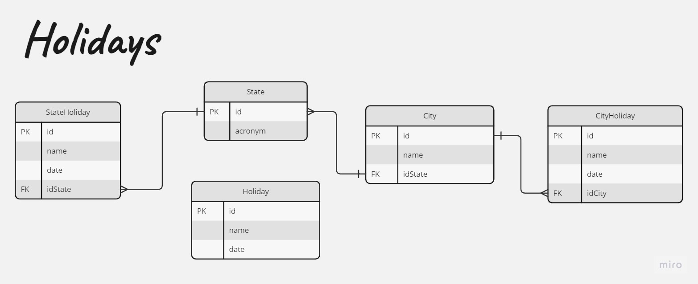

<p align="center">
  
  <br>
</p>
<div align=center>
    <a href="#desc">Descrição</a> | <a href="#prerequisites">Pré Requisitos</a> | <a href="#running">Rodando</a> | <a href="#rules">Regras de Negocio</a> | <a href="#tests">Testes</a> | <a href="#ci">Enrega Contínua</a>
</div>
<br>
<hr>
<h2 id="desc">
    Descrição
</h2>

Solução para o [problema da instruct](https://github.com/instruct-br/teste-backend-remoto-2020-07) utilizando entrega contínua para verificação do código a cada push. 
Este projeto consiste em uma API para consultar informações sobre feriados em diferentes regiões do Brasil. Com ele, é possível obter detalhes sobre feriados estaduais, municipais e nacionais, facilitando a gestão de eventos e planejamento de atividades. 
A aplicação é construída usando Nest.js e integra um banco de dados PostgreSQL para armazenar e recuperar informações sobre feriados em diferentes localidades.

- - - -

<h2 id="prerequisites">
    Pré Requisitos
</h2>

Para facilitar a instalação de todas as dependências do projeto e executar de uma forma simples e rápida, foram utilizadas as seguintes ferramentas: 
- [Docker](https://docs.docker.com/get-docker/)
- [Docker-compose](https://docs.docker.com/compose/install/)
  
Porém é possível rodar o projeto de outra forma, segue as dependências para tal:
- [Node 18](https://nodejs.org/en/download)
- [PostgreSQL](https://www.postgresql.org/download/)


- - - -

<h2 id="running">
    Rodando
</h2>

### Docker

1. Apenas executar o comando para inciar a API (porta 3000), o docker fará o restante do trabalho 🧙‍♂️
```
make server
```

### Node e PostgreSQL
Aqui, é necessário já possuir o postgresql instalado e devidamente configurado.

0. Copiar o conteúdo do .env.example para um novo arquivo .env
1. Instalar as dependencias
```
npm install
```

2. Executar as migrações do banco de dados
```
npx prisma migrate dev
```

3. Executar as seeds para preencher o banco
```
npm run seed:fill
```

4. Rodar o projeto
```
npm run start
```


<h2 id="rules">
    Regras de Negocio
</h2>

Para solucionar o problema, não faria sentido cadastrar um feriado para sempre (com exceção dos feriados nacionais), sendo assim no .env é definido uma variável YEAR_RANGE que vai definir por quanto tempo aquele feriado será válido. 
Outra variável inserida foi a CURRENT_YEAR visto que os testes dados pelo problema foram anos anteriores, o padrão foi de 2020 nos testes.

As tabelas do banco de dados se relacionam da seguinte forma:



<h2 id="tests">
    Testes
</h2>

Os testes foram extraídos do repositório original e adaptados para a estrutura do Jest, para executá-los basta rodar o comando:

```
make tests
```
ou 

```
npm run test:e2e
```

<h2 id="ci">
    Entrega Contínua 
</h2>

O código passa por três verificações:

### Build 📦
Para verificar as dependências do projeto, se é possível rodá-lo. 

### Lint ✨
Verificar o padrão do código, garantindo que todo o código esteja coerente e de facil entendimento para todos.

### Test 🧪
Rodar os testes unitários do sistema e garantir que todos passem.

Essa verificações/etapas removem o problema comum de “Mas, na minha máquina funciona”.


